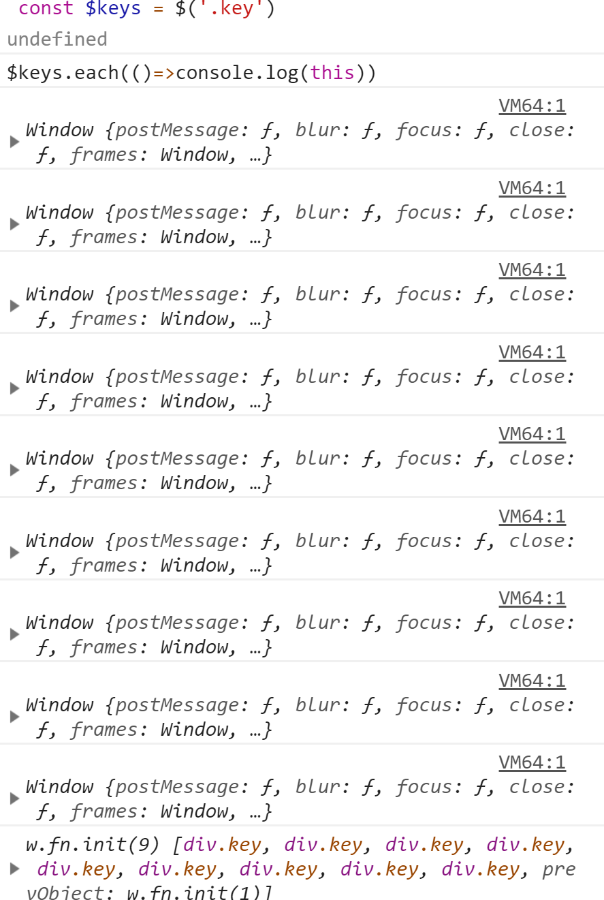
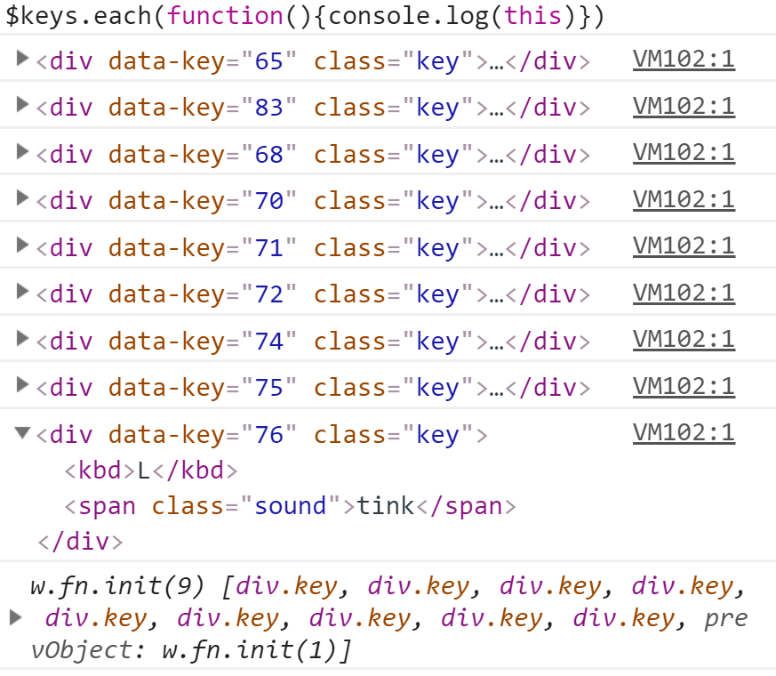

# 纯JS模拟敲鼓效果

## 功能
模拟敲鼓效果，当按下A, S, D, F, G, H, J, K, L 时会产生相应的动画和声音。

## 要点
* 键盘事件
* 播放声音
* 改变样式

## 知识点

### ES6语法
* `const`: 声明一个只读的常量，标识符的值只能赋值一次。具体请看[Constants-命令](http://es6.ruanyifeng.com/#docs/let#const-%E5%91%BD%E4%BB%A4) 

* `字符串 ${ 变量、属性名 } `：模板字面量（Template literals）中用于表示模板字符串的标识。特点是字符串首尾用反引号（`），内部的模板部分用 ${ } 括起来表示. 具体请看[模版字符串](http://es6.ruanyifeng.com/#docs/string#%E6%A8%A1%E6%9D%BF%E5%AD%97%E7%AC%A6%E4%B8%B2)
```
var customer = { name: "Foo" }
var card = { amount: 7, product: "Bar", unitprice: 42 }
var message = `Hello ${customer.name},
want to buy ${card.amount} ${card.product} for
a total of ${card.amount * card.unitprice} bucks?`
```


### 箭头函数
注意函数体内的this对象，就是定义时所在的对象，而不是使用时所在的对象。具体请看[阮一峰 箭头函数](http://es6.ruanyifeng.com/#docs/function#%E7%AE%AD%E5%A4%B4%E5%87%BD%E6%95%B0)   [廖雪峰箭头函数](https://www.liaoxuefeng.com/wiki/001434446689867b27157e896e74d51a89c25cc8b43bdb3000/001438565969057627e5435793645b7acaee3b6869d1374000)


## 难点

* 如何将键盘按键与页面按钮对应起来？
* 如何保证按键被按住不放时，可以马上响起连续鼓点声？
* 如何使页面按钮恢复原状？

[详细解答](https://github.com/soyaine/JavaScript30/tree/master/01%20-%20JavaScript%20Drum%20Kit)

## 有用的链接
[JavaScript Drum Kit 中文指南](https://github.com/soyaine/JavaScript30/tree/master/01%20-%20JavaScript%20Drum%20Kit)

[阮一峰 箭头函数](http://es6.ruanyifeng.com/#docs/function#%E7%AE%AD%E5%A4%B4%E5%87%BD%E6%95%B0)  

[廖雪峰箭头函数](https://www.liaoxuefeng.com/wiki/001434446689867b27157e896e74d51a89c25cc8b43bdb3000/001438565969057627e5435793645b7acaee3b6869d1374000)

[StringInterpolation](http://es6-features.org/#StringInterpolation)

[Constants](http://es6-features.org/#Constants)

---


# jQuery版本

[效果](https://qinjingfei.github.io/JS30/01%20-%20JavaScript%20Drum%20Kit/index-jquery.html)


## 知识点

 ### jQuery对象与DOM对象
 
 jQuery 对象就是通过jQuery包装DOM对象后产生的对象。jQuery对象是jQuery独有的。
 jQuery 对象中无法使用DOM对象的任何方法。同样，DOM对象也不能使用jQuery里的方法

 ```
  var domObj = document.getElementById("id") // DOM对象
  var $jqueryObj = $('#id') //jquery 对象
 ```

 * jQuery对象转成DOM对象

 ```
 //命名
 var $variable = jQuery 对象
 var variable  = DOM 对象
 ```
 jQuery 提供两种方法将jQuery对象转化为DOM对象，`[index]`和`get(index)`

 ```
 var $cr = $("#cr")  //jQuery对象
 var cr = $cr[0]     // DOM对象
 ```

```
 var $cr = $("#cr")  //jQuery对象
 var cr = $cr.get(0) // DOM对象
```

* DOM对象转成jQuery对象

对于一个DOM对象，只需要用`$()`吧DOM对象包装起来，就可以获得一个jQuery对象。

```
var cr = document.getElementById("cr") //DOM对象
var $cr = $(cr)                        //jQuery对象

 ```

### .on()

```
.on( events [, selector ] [, data ], handler )
```
Description: Attach an event handler function for one or more events to the selected elements.
[具体请看.on()](http://devdocs.io/jquery/on)

### .each()

```
.each( function )
```
Description: Iterate over a jQuery object, executing a function for each matched element.

[具体请看.each()](http://devdocs.io/jquery/each)


### 箭头函数产生的错误

```
 $keys.each(()=>$(this).on('transitionend',removeTransition)）//runtime error

 function removeTransition(e,){  
    if(e.originalEvent.propertyName!== 'transform') return
    $(this).removeClass('playing')
  }
```
在上面已经说过了，注意函数体内的this对象，就是定义时所在的对象，而不是使用时所在的对象。
箭头函数中`this`指向全局变量`window`


正确的做法:
```
$keys.each(function () {
     $(this).on('transitionend',removeTransition)
    })
```

上面函数中`this` 指向$keys数组中的对象
