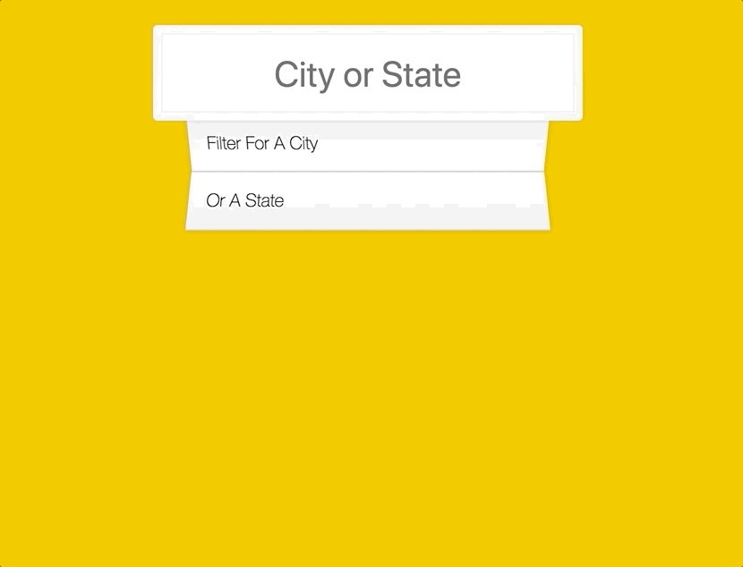

# Type Ahead 指南

## 实现效果 
 
 [效果](https://qinjingfei.github.io/JS30/06%20-%20Type%20Ahead/index-jing.html)
 
 
 
 
## 知识点
 
* Promise
 	 * fetch 	

* Array
	* filter()
 	* map()
 	* push()
 	* join()
* RegExp
 	* match()
 	* replace()

这个比较简单。有任何问题请看链接里的笔记。

## 链接

[未枝丫的笔记](https://github.com/soyaine/JavaScript30/tree/master/06%20-%20Type%20Ahead)