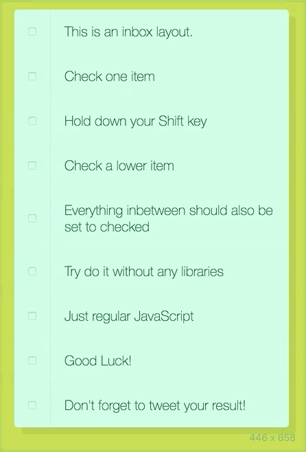

#  10 JS 实现 Checkbox 中按住 Shift 的多选功能

## 效果





## 过程指南


1. 获取所有`input`元素，并添加事件监听

```javascript
const checkboxes = document.querySelectorAll('.inbox input[type="checkbox"]')
checkboxes.forEach(item => item.addEventListener('click', handleEvent))
```

注意：`click`事件对象有一个shiftKey属性, 具体请看[这里](http://developer.mozilla.org/en-US/docs/Web/Events/click)

2. 编写 handleCheck 内部的处理逻辑


## 解决思路

将问题分解

1. 选中第一个checkbox
2. 按住shift key
3. 再选中第二个checkbox
4. 两个checkbox之间的所有项都被选中


Wes Bos 提供的解决方案：用一个变量，标记两个checkbox之间的范围

* 当选中第一个checkbox时
  * lastChecked 等于第一个checkbox的元素
* 当按下shift key && 选中第二个checkbox时
  * 遍历整个checkbox 列表
    * 若遇到 第一个checkbox或第二个checkbox，则将标记值取反
    * 若`inBetween`为true, 则checkbox 被选中

默认`inBetween`为false, 也就是说默认情况下checkbox 不会被选中。只有当遇到第一个checkbox, `inBetween`会变为true。第一个 checkbox之后的checkbox都会被选中，直到遇到第二个checkbox。这时的`inBetween`会变为false，跟默认情况相同checkbox不会被选中。


```javascript
	let lastChecked
    function handleEvent(e) {
      let inBetween = false
      if (e.shiftKey && this.checked) {
        checkboxes.forEach(item => {
          // 若遇到 B 或 A，则将标记值取反
          if (item === this || item === lastChecked) {
            inBetween = !inBetween
          }
          if (inBetween) {
            item.checked = true
          }
        })
      }
      lastChecked = this // A(选中的第一个checkbox)
    }
```


## Credits

[未枝丫的笔记](https://github.com/soyaine/JavaScript30/tree/master/10%20-%20Hold%20Shift%20and%20Check%20Checkboxes)

文章的主要内容来自上面的链接，此文章仅作为我自己的笔记 , 侵权必删。